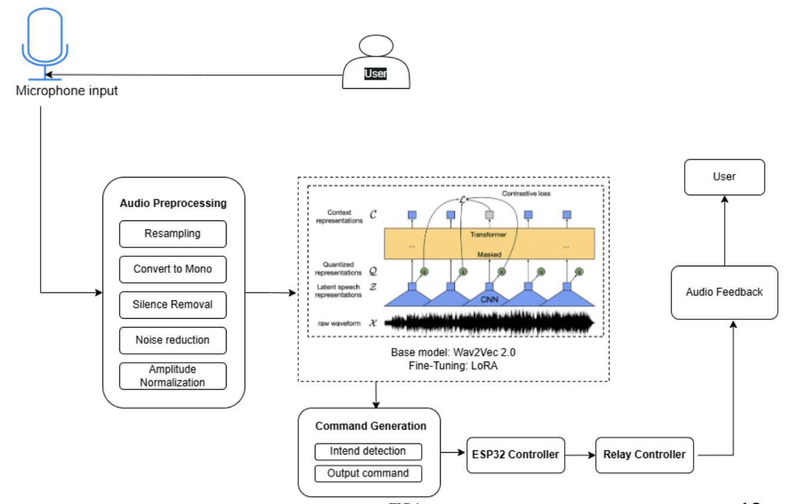
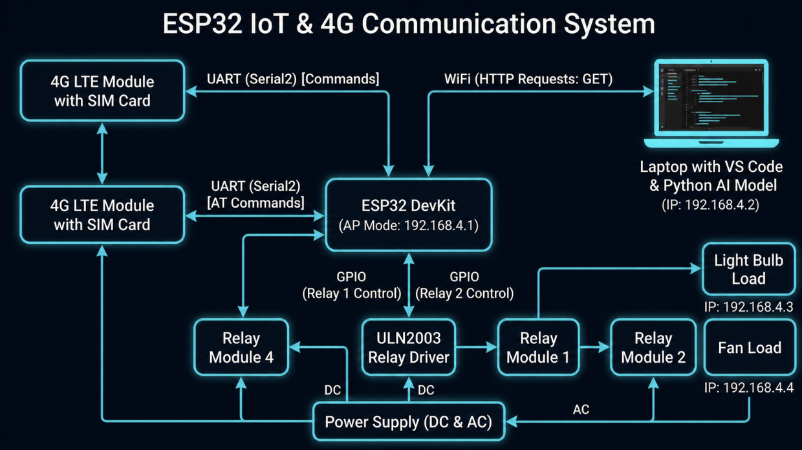
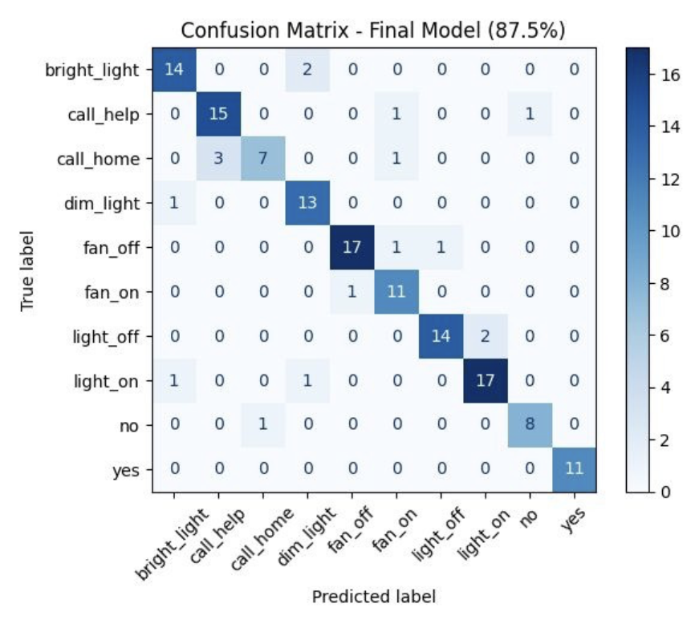

# 🧠 SpeakEasy: A Personalized Smart Home Assistant for Dysarthric Speech

> An AI-powered smart home assistant designed to help individuals with dysarthric speech interact with home appliances using voice commands.

---

## 📖 Overview

SpeakEasy is a final-year undergraduate project that enables individuals with dysarthric speech to control smart home devices through voice commands. The system leverages a fine-tuned **Wav2Vec2** speech recognition model with **LoRA (Low-Rank Adaptation)** to recognize dysarthric speech accurately and convert it into actionable smart home commands.

The application provides an intuitive web interface for recording speech, predicts the intended command, requests user confirmation to reduce incorrect actions, and then communicates with an ESP32-based smart home controller to execute the command.

---

## 🎥 Demo

A demonstration video showcasing the complete workflow of SpeakEasy—including voice command recognition, confirmation, and smart home device control—will be added soon.

> 📹 Demo video: Coming soon

## ✨ Features

* 🎤 Browser-based voice recording
* 🧠 AI-powered dysarthric speech recognition
* 🚀 Fine-tuned Wav2Vec2 model using LoRA
* 🌐 Flask-based web application
* 🏠 ESP32 smart home integration
* ✅ Confirmation step ("Yes" / "No") before executing commands
* ⚡ Real-time command prediction
* ♿ Designed specifically for accessibility

---

## 🏠 Supported Voice Commands

* Light On
* Light Off
* Fan On
* Fan Off
* Bright Light
* Dim Light
* LED Off
* Call Help
* Call Home
* Yes (confirmation)
* No (cancel)

---

## 🛠️ Technology Stack

| Category             | Technology            |
| -------------------- | --------------------- |
| Programming Language | Python                |
| Deep Learning        | PyTorch               |
| Speech Model         | Wav2Vec2 MMS-1B       |
| Fine-Tuning          | LoRA                  |
| Web Framework        | Flask                 |
| Audio Processing     | Librosa               |
| Hardware             | ESP32                 |
| Frontend             | HTML, CSS, JavaScript |

---

## 🔄 System Workflow

1. User records a voice command using the web interface.
2. The audio is preprocessed and converted to the required format.
3. The fine-tuned Wav2Vec2 model predicts the spoken command.
4. The system asks the user for confirmation.
5. After confirmation, the command is sent to the ESP32.
6. The corresponding smart home appliance performs the requested action.

---

## 🏗️ System Architecture

This diagram represents the complete workflow of SpeakEasy, starting from voice input to final smart home device execution.

The system processes speech input through a web interface, uses a fine-tuned Wav2Vec2 + LoRA model for command prediction, and sends the validated command to an ESP32 microcontroller for real-world device control.

### System Flow

- User records voice input via browser
- Audio is processed and sent to Flask backend
- Wav2Vec2 model predicts command
- User confirms action (Yes/No)
- ESP32 executes the final command

### Architecture Diagram

> This shows how all components interact in the system.



## 📡 IoT Device Architecture

The IoT layer of SpeakEasy is responsible for executing real-world actions using an ESP32 microcontroller.

Once the AI model predicts and the user confirms a command, the Flask backend sends an HTTP request to the ESP32. The ESP32 then triggers the corresponding relay or GPIO pin to control smart home devices like lights and fans.

### Communication Flow

- Flask backend sends HTTP request
- ESP32 receives command via WiFi
- Microcontroller maps command to device action
- Relay switches ON/OFF appliances

### IoT Architecture Diagram



## 📱 Web Interface

The SpeakEasy web interface provides an accessible and simple way for users to interact with the system using voice commands.

Users can record speech directly from the browser, and the audio is sent to the backend for processing. The system then predicts the intended command using the trained Wav2Vec2 model and asks for user confirmation before executing any action.

This ensures safe and controlled operation of smart home devices.

> 📌 Web interface screenshot will be added soon. This interface allows real-time voice command recording and prediction.

## 📊 Experimental Results

The SpeakEasy model was evaluated using classification and speech recognition metrics. These results demonstrate the model’s ability to accurately recognize dysarthric speech commands.

### Confusion Matrix

The confusion matrix shows the model’s performance in distinguishing between different voice commands and highlights classification accuracy across all categories.



### Word Error Rate (WER)

Word Error Rate (WER) is used to evaluate the performance of the speech recognition model. It measures the difference between the predicted command and the actual spoken command.

A lower WER indicates better speech recognition performance, especially important for dysarthric speech where pronunciation can vary significantly.


### Accuracy

The accuracy graph shows the model’s performance improvement during training. It reflects how well the model learns to classify speech commands over time.


---

### Loss

The loss graph represents the training loss reduction over epochs. A decreasing loss indicates that the model is learning effectively.


## 📂 Project Structure

```text
SpeakEasy/
│
├── app.py
├── requirements.txt
├── models/
├── Training Notebook/
├── Testing Notebook/
├── Output Images/
├── static/
└── templates/
```

---

## 🚀 Installation

1. Clone the repository.
2. Install the required dependencies.

```bash
pip install -r requirements.txt
```

3. Add the trained model to the `models` directory (not included in this repository).
4. Run the application.

```bash
python app.py
```

---

## 📸 Screenshots

Screenshots will be added soon.

---

## 🔮 Future Improvements

* Improve recognition accuracy with larger dysarthric speech datasets.
* Support additional smart home devices.
* Enable cloud deployment.
* Add multilingual support.
* Integrate voice authentication for enhanced security.

---

## 👨‍💻 Contributors

Developed as a final-year undergraduate team project by:

* **Adithyan V**
* **Anjana S**
* **Haifa Shanavas**

---


